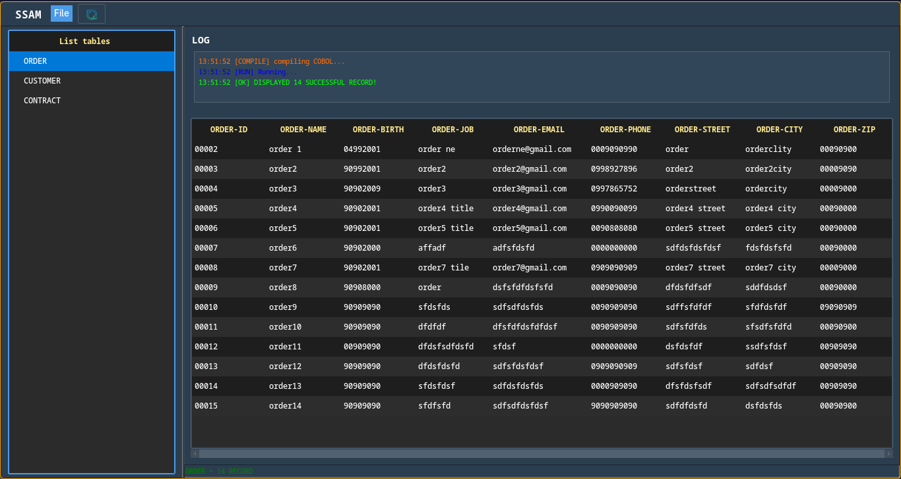

<p align="center">
  
</p>


## INSTALL
- sh -c "$(curl -fsSL https://raw.githubusercontent.com/YasashiiRin/SAMTOOL/main/install.sh)"

- echo 'export PATH="$HOME/.local/bin:$PATH"' >> ~/.zshrc
- source ~/.zshrc


# 📘 SSAM – Quy ước lưu trữ & mô tả cấu trúc dữ liệu

## 1. 📂 File `.dat , .db`
- Là file **dữ liệu nhị phân**.
- Là nguồn dữ liệu chính của hệ thống.
- Được đọc/ghi bởi chương trình COBOL hoặc SSAM Viewer.
- **Không chứa mô tả cấu trúc**.

**Ví dụ:**
customer.dat
transaction.dat
employee.dat


---

## 2. 🧩 File `.cpy` – File mô tả cấu trúc dữ liệu

Các file `.cpy` là **copybook COBOL**, dùng để mô tả cấu trúc của file `.dat, .db`.
### 🔶 Lưu ý quan trọng
không nên gộp chung copybook mô tả cấu trúc dữ liệu VSAM (FD copybook) với copybook dùng cho WORKING-STORAGE (WS copybook).
Thông lệ chuẩn và cả lợi ích thực tế đều khuyến nghị tách rời.

và SSAM cũng cũng thực hiện cơ chế quét dữ liệu theo cấu trúc này

### ✅ Quy ước đặt tên file `.cpy` cho SSAM

| File dữ liệu | File mô tả cấu trúc | Ghi chú |
|--------------|----------------------|---------|
| abc.dat      | abc.cpy              | ✔ Hợp lệ |
| employee.dat | employee.cpy         | ✔ Hợp lệ |
| data1.dat    | data1.cpy            | ✔ OK |

### ✅ Cấu trúc mẫu
```cobol
database/
├── CUST-MASTER.dat
shared/
├── CUST-MASTER.cpy          ← CHỈ chứa FD + 01 record (dùng cho FILE SECTION)
├── CUST-MASTER-WS.cpy       ← CHỈ chứa Working-Storage (dùng cho chương trình xử lý)
```
### Điều kiện:
- Tên file **phải trùng 100%** trước phần mở rộng.  
- **Mỗi file `.dat` bắt buộc có một file `.cpy` tương ứng.**  
- File `.cpy` phải mô tả **đầy đủ cấu trúc record**

---

## 3. 📝 Ví dụ về file `.cpy` cho FD đúng chuẩn

```cobol
01 CUSTOMER-REC.
    05 CUST-ID        PIC 9(6).
    05 CUST-NAME      PIC X(30).
    05 STATUS         PIC 9(1).
```    


## 4. ⚠️ Lưu ý quan trọng về file `.cpy`

### 🔶 4.1 COPYBOOK dùng cho Working-Storage **không được sử dụng** cho SSAM

Trong COBOL, file `.cpy` thường được dùng để:

- khai báo biến tạm (Working-Storage)
- hằng số
- counters hoặc flags ...

⚠️ **Các nội dung này không được đưa vào file `.cpy` dùng cho SSAM.**

---

### 🔶 4.2 File `.cpy` dùng cho SSAM **chỉ được chứa cấu trúc RECORD**

✔ **Hợp lệ** (mô tả dữ liệu thật của file):

```cobol
01 PRODUCT-REC.
    05 PROD-ID        PIC 9(5).
    05 PROD-NAME      PIC X(40).
```
✘ **Không hợp lệ** (chứa khai báo Working-Storage):
77 WS-TEMP        PIC X(10).
77 WS-COUNT       PIC 9(4).


## 5. 🔧 Gợi ý phân tách copybook trong dự án

### ✔ Cách khuyến nghị (an toàn nhất)

**File dùng cho SSAM (chỉ chứa RECORD):**
customer.cpy


**File dùng cho Working-Storage:**
customer_ws.cpy
customer_working.cpy


---

### 🚫 Không đổi tên file `.cpy` dùng cho SSAM

**Không sử dụng các tên:**
customer_rec.cpy
customer_layout.cpy
customer_struct.cpy

**Vì SSAM hoạt động theo quy tắc bắt buộc:**
<filename>.dat → <filename>.cpy


---

## 6. 🎯 Mục đích của quy ước

- Đảm bảo SSAM Viewer tự động đọc đúng cấu trúc file.  
- Tránh nhầm lẫn giữa copybook dành cho dữ liệu và copybook dành cho Working-Storage.  
- Hiển thị đúng layout và kiểu dữ liệu trong giao diện SSAM.  
- Chuẩn hóa quy trình phát triển và bảo trì.

---


